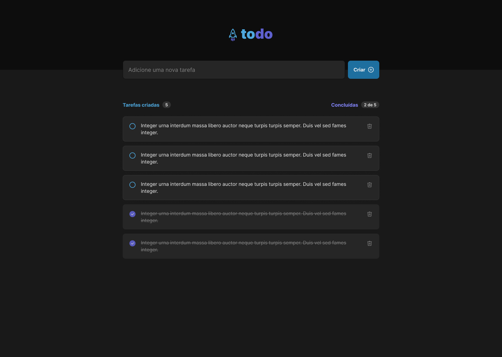
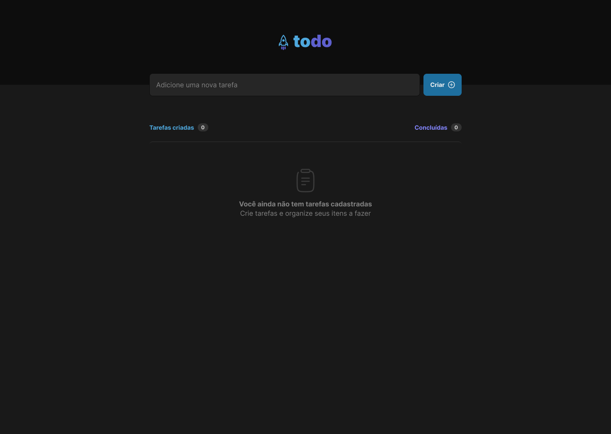

#ToDo-Ignite

Neste projeto foi desenvolvido um TODO LIST

## Instalação

Baixe o projeto e rode os sequintes comandos abaixo.

Faça o git clone deste projeto.

Apos certifiquese que você tem o Node
instalado em sua máquina.

Caso não tenha o node clique no link abaixo e faça a instação.

[nodejs](https://nodejs.org/en/download)

apos siga os execute os dois comandos abaixo

```bash

  npm install
  npm run dev
```

<h2>Tecnologias usadas</h2>
<ol>
    <li>TypeScript</li>
    <li>ReactJS/</li>
</ol>

## Link par ao projeto

<a href="https://todotarefas.bohr.io/" target="_blank">Todo List<a>

## Conheça o projeto

### Página Home



### Página Home sem TODOs


